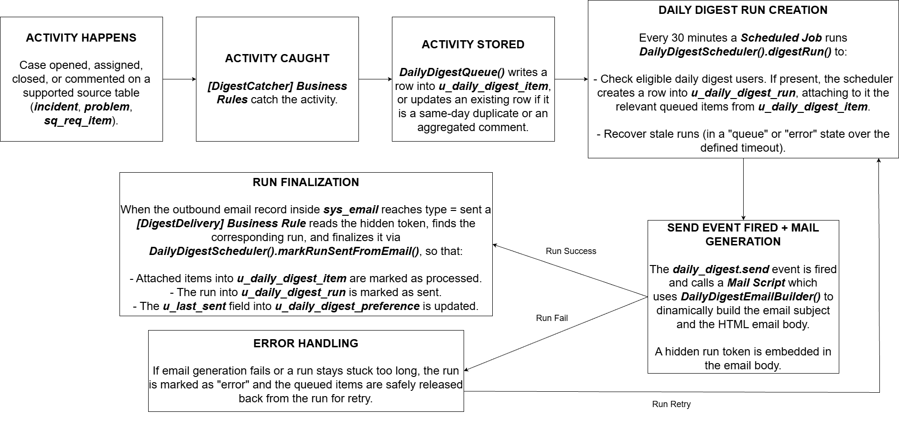
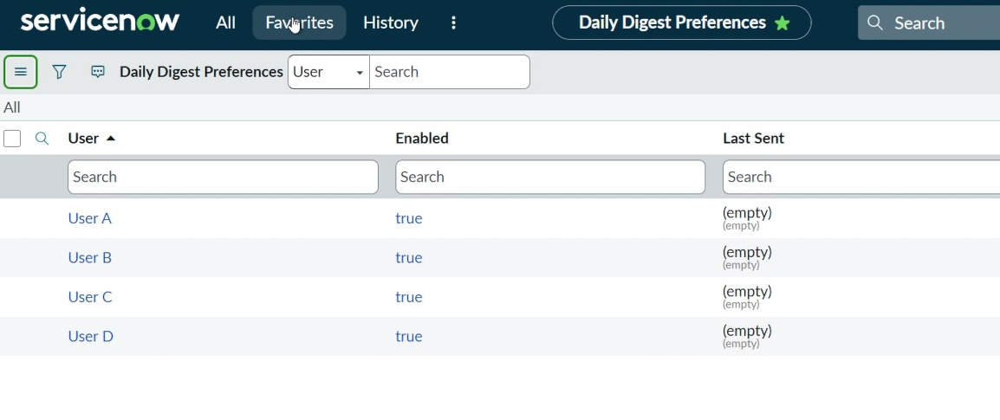
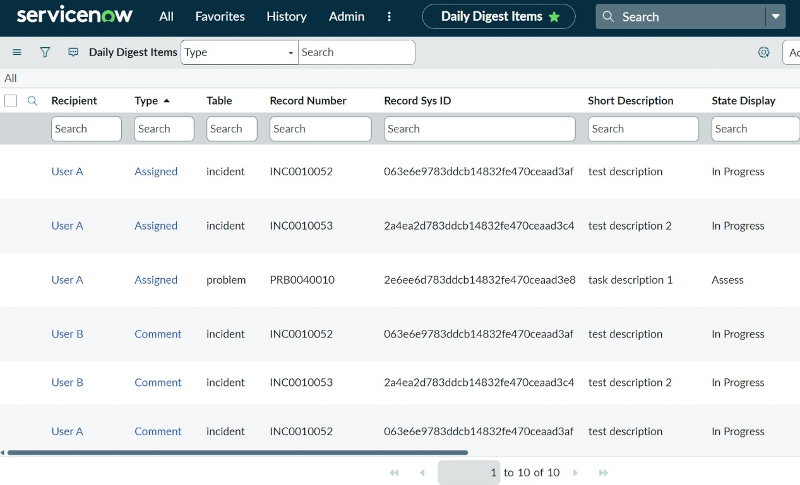
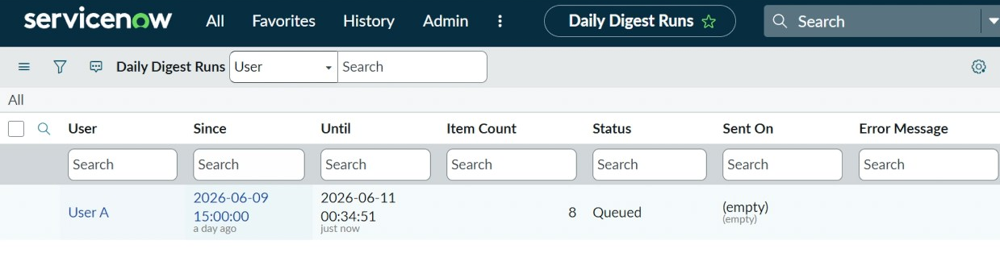
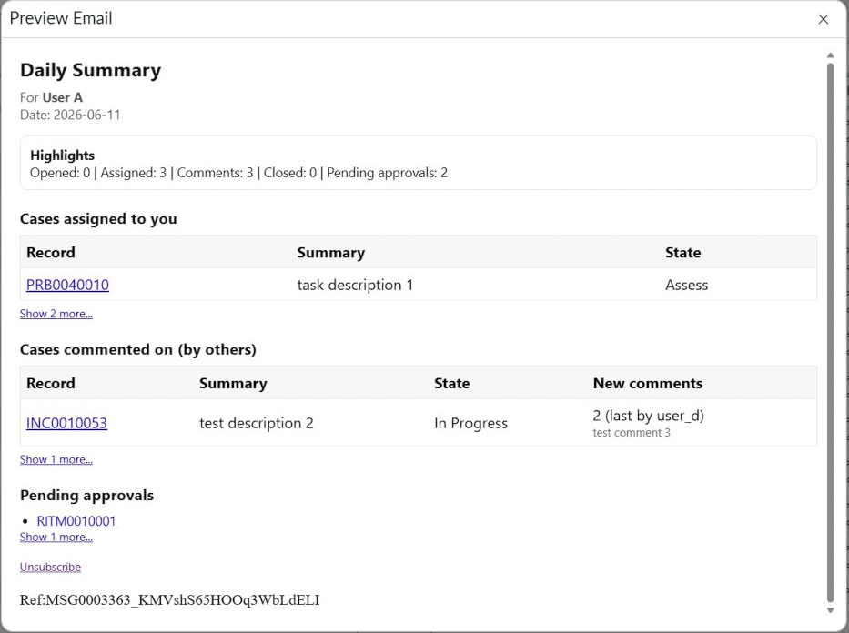

# [Proof of Concept] ServiceNow Daily Digest Email Notification

> Portfolio project built on a ServiceNow Personal Developer Instance (PDI). The goal is to reduce notification burden by collecting relevant activity during the day and sending one consolidated digest email per user at the end of the business day.

[Presentation Link](presentation/daily-digest-presentation.pdf)

## Disclaimer

This is a personal portfolio project created for learning and demonstration purposes. It is not an official ServiceNow product or plugin. It is not intended for production-ready environments.

## Overview

This project implements a custom **Daily Digest Email Notification** in ServiceNow.

Instead of sending many separate notifications every time a case is opened, assigned, closed, or commented on, the implementation captures those activity as queue items and sends a single daily summary to each eligible user.

The solution follows a **queue now, send later** pattern:

1. **Capture layer**: Business Rules catch the relevant activity when they happen.
2. **Orchestration layer**: a Scheduled Job decides which users are eligible for a digest and creates a digest run.
3. **Delivery layer**: an event-based notification and mail script build the final HTML email and mark the run as sent only after the outbound email is successfully sent.

## Business Problem

In a ServiceNow environment, users can receive many separate notifications during the day: cases opened by them, cases assigned to them, comments added to cases they are involved in, cases closed, pending approvals, etc.

This can create notification fatigue and make important updates harder to follow.

The business goal of this implementation is to provide a **daily per-user summary** that:

- reduces the number of individual emails;
- groups related activity into clear sections;
- respects user opt-in/opt-out preferences;
- sends the digest at the end of the business day in the user's local time zone;
- provides links back to the related ServiceNow cases;
- avoids sending duplicate digest items for the same record and day;
- supports recovery when a digest run fails or stays stuck too long.

## Solution Summary

The ServiceNow version used is **Zurich**. The implementation includes three custom tables:

| Table | Purpose |
| --- | --- |
| `u_daily_digest_preference` | Stores each user's daily digest preference and last sent timestamp. |
| `u_daily_digest_item` | Stores queued activity items before they are sent. |
| `u_daily_digest_run` | Stores one digest send attempt for one user and one time window. |

It also includes Script Includes, Business Rules, Scheduled Script Executions, a custom event, an Email Notification, an Email Script, ACL rules, system properties, and a small unsubscribe UI page. For more details keep reading the following sections or refer to [CUSTOM_CONFIGS.md](docs/CUSTOM_CONFIGS.md) file or to [scripts](scripts/) folder.

## Architecture

The project is divided into three main layers.

### 1. Capture Layer

Business Rules listen for activity on supported source tables:

- `incident`
- `problem`
- `sc_req_item`
- `sys_journal_field` for comments

When an activity happens, the Business Rule calls `DailyDigestQueue`, which inserts or updates a row in `u_daily_digest_item`.

Captured activity types include:

- cases opened by the user;
- cases assigned to the user;
- cases closed while the user is involved;
- new comments on cases where the user is involved.

The queue uses a unique key based on recipient, activity type, source table, source record, and the recipient's local date. This helps prevent duplicate items and allows comments on the same record to be aggregated into a single digest row.

### 2. Orchestration Layer

A Scheduled Script Execution runs every 30 minutes and calls:

```javascript
DailyDigestScheduler().digestRun()
```

`DailyDigestScheduler` is responsible for:

- recovering stale `ready` or `queued` runs;
- finding candidate users with queued digest items or pending approvals;
- checking whether the user has daily digest enabled;
- checking whether the configured local send time has been reached;
- preventing more than one digest per user per local day;
- creating a `u_daily_digest_run` record;
- claiming queued digest items for that run;
- firing the `daily_digest.send` event.

### 3. Delivery Layer

The `daily_digest.send` event triggers the custom Daily Digest Email Notification.

The notification uses the `daily_digest_body` Email Script, which calls `DailyDigestEmailBuilder` to dynamically build:

- the email subject;
- the HTML body;
- the activity sections;
- record links;
- pending approval links;
- “show more” links when a section has more than the configured display limit;
- an unsubscribe link.

A hidden run token is embedded in the email body. When the corresponding outbound email record in `sys_email` reaches `type = sent`, the `[DigestDelivery]` Business Rule calls `DailyDigestScheduler.markRunSentFromEmail()` to finalize the run.

Finalization marks:

- linked digest items as processed;
- the digest run as sent;
- the user's `u_last_sent` timestamp.

If email generation fails, or a run stays stuck too long, the implementation marks the run as error and safely releases the queued items for retry.

## Main Components

| Component | Type | Responsibility |
| --- | --- | --- |
| `u_daily_digest_preference` | Custom table | Stores per-user digest settings and last sent date. |
| `u_daily_digest_item` | Custom table | Stores queued digest items. |
| `u_daily_digest_run` | Custom table | Stores digest run status and delivery window. |
| `DailyDigestConfig` | Script Include | Reads shared system properties and configuration values. |
| `DailyDigestQueue` | Script Include | Captures activity and inserts or aggregates digest items. |
| `DailyDigestScheduler` | Script Include | Finds candidate users, creates runs, queues events, finalizes sends, and recovers stale runs. |
| `DailyDigestEmailBuilder` | Script Include | Builds the final digest email subject and HTML body. |
| `[DigestCatcher]` Business Rules | Business Rules | Capture opened, assigned, closed, and comment activity. |
| `[DigestDelivery]` Business Rule | Business Rule | Detects sent outbound emails and finalizes the related run. |
| `Daily Digest Scheduler Runner` | Scheduled Job | Runs the orchestration process every 30 minutes. |
| `daily_digest.send` | Event | Connects run creation to the email notification. |
| `daily_digest_body` | Email Script | Calls the email builder and prints the generated HTML. |
| `daily_digest_unsubscribe` | UI Page | Allows users to disable their daily digest preference. |

## Features

- Per-user daily digest preferences.
- Queue-based activity capture.
- Daily local-time delivery logic.
- Duplicate prevention using unique digest keys.
- Comment aggregation using a counter and latest comment preview.
- Pending approvals included in the final digest.
- Digest run status tracking: `ready`, `queued`, `sent`, `error`.
- Stale run recovery and retry support.
- Outbound email confirmation before marking a run as sent.
- HTML email generation with record links and section summaries.
- “Show more” links for sections with many cases.
- User unsubscribe page.
- ACLs so users can only access their own digest preference/items.
- Cleanup scheduled job for old processed items and old completed/error runs.

## Repository Structure

```text
custom-servicenow-daily-digest-email-notification/
├── README.md
├── update-set/
│   └── custom_daily_digest_update_set.xml
├── scripts/
│   ├── DailyDigestConfig.js
│   ├── DailyDigestQueue.js
│   ├── DailyDigestScheduler.js
│   └── DailyDigestEmailBuilder.js
├── docs/
│   ├── CUSTOM_CONFIGS.md
│   └── images/
│       ├── 00-high-level-architecture.png
│       ├── 01-user-preference.png
│       ├── 02-digest-items-queued.png
│       ├── 03-digest-run-created.png
│       ├── 04-digest-email-preview.png
│       └── 05-full-demo-flow.mp4
└── presentation/
    └── daily-digest-presentation.pdf
```

## Showcase

### 1. High-Level Architecture




This diagram shows the full flow:

```text
Activity happens → Business Rules catch the activity → DailyDigestQueue stores or aggregates the activity → Scheduled Job creates a digest run → Event + Email Notification generate the email → Delivery Business Rule confirms the outbound email was sent → Run and items are marked as finalized
```

### 2. Full Demo Flow

https://github.com/user-attachments/assets/713bbbce-e52e-4a8d-bca3-aa01c60cdc72

### 3. Demo Images

User Preferences:



Digest Items Created:



Digest Run Created:



Daily Digest Email:



## Configuration

The configuration parameters are stored in the system properties table:

| Property | Example value | Purpose |
| --- | --- | --- |
| `daily_digest.source_tables` | `incident,problem,sc_req_item` | Source tables monitored by the digest. |
| `daily_digest.journal_element_types` | `comments` | Journal field types included in comment capture. |
| `daily_digest.default_send_time` | `17:00:00` | Default local time when the digest should be sent. |
| `daily_digest.queue_timeout_minutes` | `120` | Timeout for recovering stale queued runs. |

## Installation / Import

This project was built on a ServiceNow Personal Developer Instance.

To review or import it into another non-production instance:

1. Clone or download this repository.
2. Import the update set XML from the `update-set/` directory.
3. Preview the update set.
4. Resolve any preview errors or collisions.
5. Commit the update set.
6. Review the custom tables, Business Rules, Script Includes, Scheduled Jobs, Event, Notification, Email Script, ACLs, and UI Page.
7. Configure the system properties.
8. Test.

> Note: this repository is intended for portfolio review and learning purposes. Do not import it directly into a production instance!

## What I Learned

Through this project I practiced and learned:

- designing a ServiceNow solution around a real business problem;
- modeling custom tables and relationships;
- using Business Rules to capture record activity;
- writing reusable server-side Script Includes;
- working with `GlideRecord` and `GlideAggregate`;
- using system properties for configurable behavior;
- designing queue-based processing instead of querying everything at send time;
- handling duplicate prevention and comment aggregation;
- handling user local time zones for daily processing;
- creating Scheduled Script Executions;
- using events to trigger email notifications;
- building dynamic HTML email content with Mail Scripts;
- adding recovery logic for failed or stale runs;
- thinking about ACLs and user-specific data access;
- preparing a technical implementation for portfolio presentation.

## Limitations

- Built and tested in a Personal Developer Instance, not in a production environment.
- The implementation is a personal portfolio project, not a packaged commercial application.
- Java date/time APIs are used in some places for timezone formatting; this should be reviewed for compatibility in future ServiceNow releases.
- The current implementation focuses on selected tables (`incident`, `problem`, and `sc_req_item`) but could be expanded.
- The email design is functional and can be improved with a more polished responsive layout.
- Automated Test Framework coverage is not included yet.

## Possible Future Improvements

- Move the implementation into a scoped application.
- Add Automated Test Framework tests.
- Add a Service Portal or Workspace preference page.
- Add per-user configurable send time.
- Add admin dashboard metrics for digest volume and delivery success.
- Add more notification categories.
- Improve email styling and mobile responsiveness.
- Add integration tests for retry and stale-run recovery scenarios.

## Security and Privacy Notes

- No real customer or company data has been included.
- The PDI is not publicly accessible; this repository documents the implementation through code, update set, screenshots, and demo assets.
